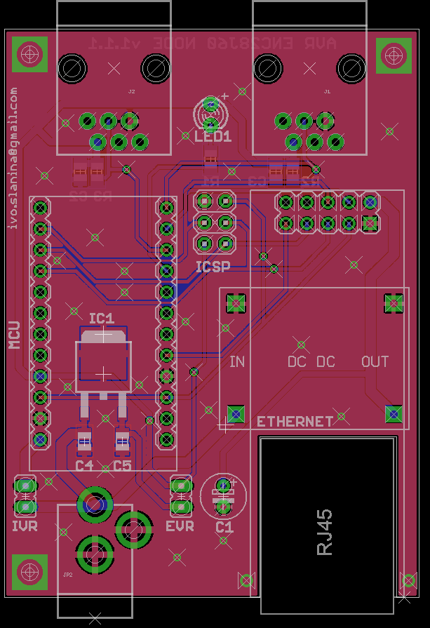

# IoT node pcb

PCB design for AVR ENC28J60 IoT node board. This repository contains only board
design files, design files for 3D printable case are stored in different repository.

## Features

 - AVR [ATmega328P](http://www.atmel.com/devices/atmega328p.aspx) main microcontroller ([Arduino Pro Mini](https://www.arduino.cc/en/Main/ArduinoBoardProMini)).
 - Ethernet connection with [ENC28J60](http://www.microchip.com/wwwproducts/en/en022889) chip.
 - ENC28J60 powered by mini DC-DC power supply module ([LM2596](http://www.ti.com/lit/ds/symlink/lm2596.pdf) chip).
 - Two RJ-11 connectors for sensors.
 - Powered using  5.5 mm power socket. Central positive,  7-12V.
 - Modular design.
 - Notification LED.
 - Intended  to be manufactured by [dirtypcbs.com](http://dirtypcbs.com/).
 - Optional on board 5V voltage stabilizer. You don't need to rely to voltage stabilizer on Arduino module.

## Images

